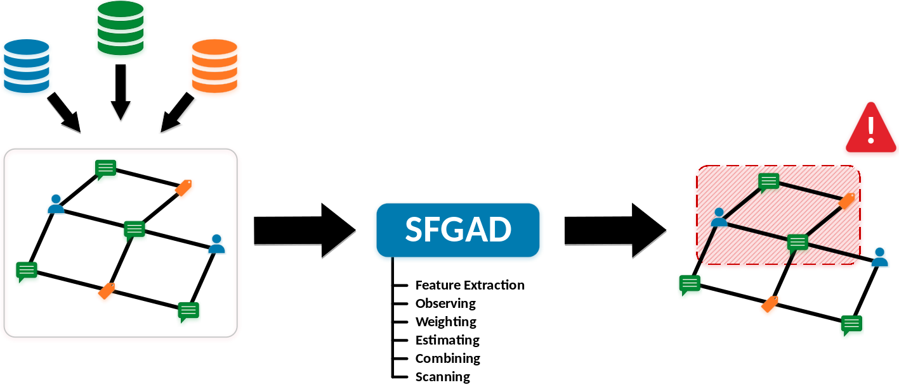

---
[](https://travis-ci.com/sudrich/sf-gad)

SFGAD is a tool for detecting anomalies in **graph** and **graph streams** with python.


I provides:

* Efficient computation of graph **features**
* Statistical models for detecting **anomalous behavior**
* Graph scanning to detect **connected graph anomalies**
* A customizable detection framework with **6** components
* Several pre-defined **configurations**

### Process
---




### Installation
---

#### Dependencies

* Python: 3.5 or higher
* NumPy: 1.8.2 or higher
* SciPy: 0.13.3 or higher
* Pandas: 0.22.0 or higher
* NetworkX: 1.11.0 or higher

#### Installation (coming soon)

Installation of the latest release is available at the [Python
package index](https://pypi.org/project/sfgad) and on conda.

```sh
conda install sfgad
```

or 

```sh
pip install sfgad
```

The source code is currently available on GitHub:
https://github.com/sudrich/sf-gad

#### Testing

For testing use pytest from the source directory:

```sh
pytest sfgad
```

## Acknowledgements

This work originated from the QuestMiner project (grant no. 01IS12051) and was partially funded by the German Federal Ministry of Education and Research (BMBF).
